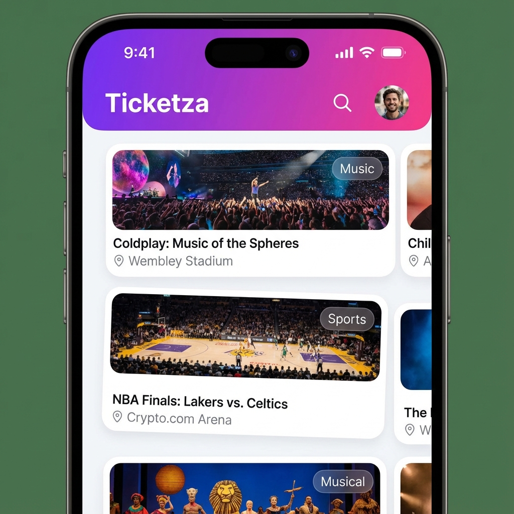
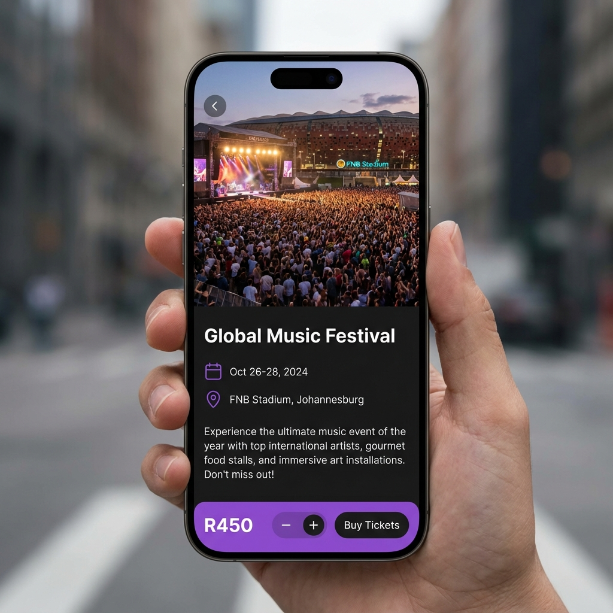
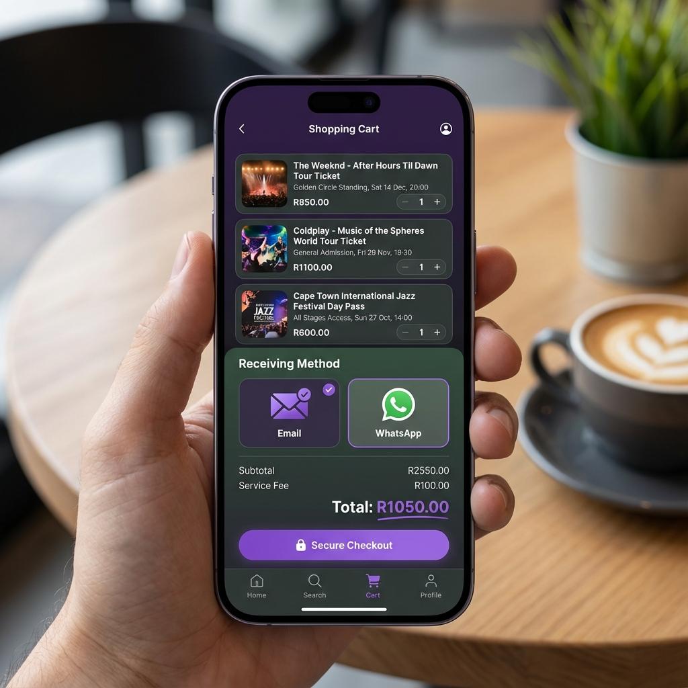
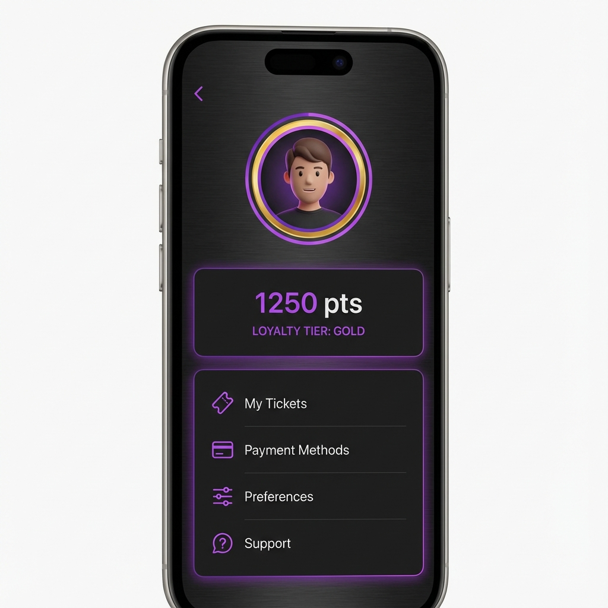

# Ticketza 🇿🇦 (Expo Mobile Application)

Ticketza is a centralized event ticketing platform designed for the South African market. This repository contains the **high-performance mobile application** built using the **Expo (React Native)** framework.

## 📱 Mobile App Features
- **Expo SDK 50+**: Optimized for the latest mobile features and performance.
- **Premium Mzansi Design**: Modern, glassmorphic UI with South African flair (Linear Gradients, HSL colors).
- **Dynamic Content**: Fetches real-time events from a FastAPI backend.
- **Advanced Cart Logic**: Manage multiple bookings with real-time tax/fee calculation.
- **Checkout Options**: Choose your preferred receiving method (**Email** or **WhatsApp**).
- **Profile Management**: Track loyalty points and manage digital tickets.

## 🖼️ App Preview
Check out the latest screenshots of the mobile experience:

| Home Screen | Event Details | Cart & Checkout | Profile |
| :---: | :---: | :---: | :---: |
|  |  |  |  |

## 🚀 Getting Started (Mobile)

1. **Install Expo Go**: Download the [Expo Go](https://expo.dev/go) app on your Android or iOS device.
2. **Setup PC**: Ensure your phone and PC are on the same Wi-Fi network.
3. **Start the App**:
   ```bash
   cd mobile
   npx expo start --lan
   ```
4. **Scan**: Open Expo Go and scan the QR code in your terminal.

---

## 🏗️ Architecture
- **Framework**: React Native with Expo.
- **Icons**: @expo/vector-icons (Ionicons).
- **Animations**: Expo Linear Gradient & native transitions.
- **Backend**: FastAPI (Python) with SQLite.

## 🎮 Access Points
- **Web Interface**: `http://localhost:3000`
- **Mobile Server**: `http://localhost:8081`
- **API Docs**: `http://localhost:8000/docs`

---
*Built with ❤️ by Antigravity for the Ticketza Platform.*
